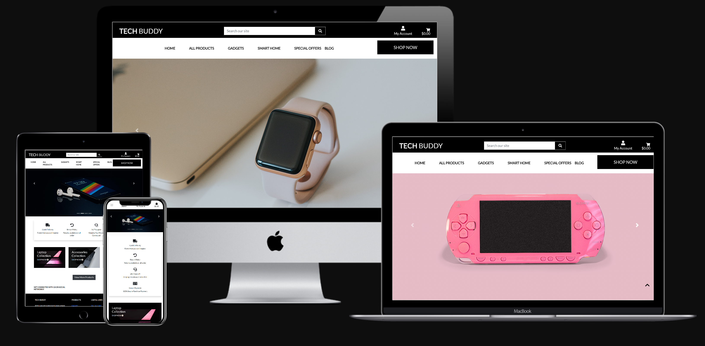
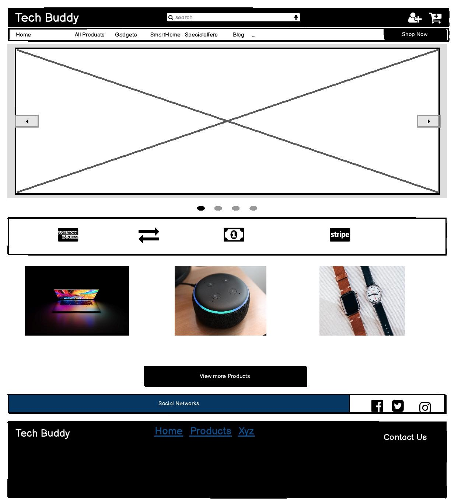
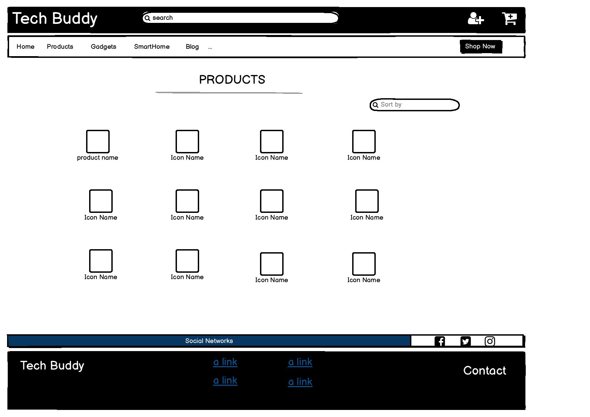

<h1 align="center">
 
  
   
     
   TECH BUDDY 
   
</h1>

<h3 align="center">Full Stack Frameworks with Django Milestone Project </h3>

<h4 align="center">Ecommerce & Blog Web Application with Stripe Payments</h4>

- [Live link](https://tech-buddy.herokuapp.com/)
- [Github Link](https://github.com/sree0831/MSP-4.git)

## Table of Contents

<!--ts-->

1. [About](#About)

    - [Goal](#Goal)
    -   [Strategy Plane](#strategy)
    -   [Project Charter](#charter)
    -   [Defensive Design](#def)

2. [UX](#UX)

    - [User stories](#User-stories)
    - [Layout Pro](#Layout-Pro-Boundless-Adaptability)
    - [Layout Con](#Layout-Con-Moderate-Speed-and-Execution)
    - [Navigation](#Navigation)
    - [Database Structure](#Database-Structure)
    -  [Wireframes](#wireframes)
        

3. [Technologies](#Technologies)

    - [Languages Frameworks Tools](#Languages-Frameworks-Tools)
    - [Other-Resources](#Other-Resources)
    - [Features](#Features)
    - [Features Left To Implement](#Features-Left-To-Implement)
    - [Challenges](#Challenges)

4. [Testing](#Testing)

    - [Tools-and-Methods-Used-for-Testing](#Tools-and-Methods-Used-for-Testing)
    - [Tested Sections 1 HTML & CSS](#Tested-Sections-1-HTML-&-CSS)
    - [Tested Sections 2 Python](#Tested-Sections-2-Python)
    

5. [Deployment](#Deployment)

    - [How the project got deployed to Heroku](#How-the-project-got-deployed-to-Heroku)
    - [How to access the live application](#How-to-access-the-live-application)

6. [Credits](#Credits)

    <!--te-->
## About

 **Tech Buddy** web application is related to Ecommerce based  site where  users can explore the products ,search ,buy products ,read about new gadgets in blog .

#### Goal

This project is my fourth milestone project for Code Institute, and it’s the Full Stack Frameworks with Django Milestone Project.
A Online E-commerce Store designed for the fictitious company named "Tech Buddy."
The aim of the project, according to the project guidelines, was to build a full-stack site based around business logic used to control a centrally-owned dataset.
This project will demonstrate what I have learned in the course from frontend, backend and full stack web development with stripe payments.
# Strategy Plane
The overall aim of the project is to create a functional app logic created with **Python** while utilising the **Django**framework,**AWS S3 Bucket**,Relational database and stripe payements. The logic of the app will be written using a variety of technologies but predominantly using the Python Django framework, jQuery and MySQL.  HTML, CSS, and JavaScript will be used to enhance the look and feel of the application. 
## Project Charter 
||Objectives |
|:---|:---|
|**Purpose:** What purpose does the website serve?|The purpose of this project is to create a ecommerce website  called Tech Buddy that sells innovative products |
|**Goals:** What outcomes does it need to achieve?|<ul><li>allow users to search products and read description about products  </li><li>add them to basket  </li><li>update your basket</li><li>shopping cart checkout based on stripe payments</li></ul>
|**Target audience:** Whom must the product appeal to and work for?|<ul><li>Users just browsing for gadgets </li><li>Checking for latest gadgtes news</li></ul>|
|**Success indicators:** How will you know you have achieved project goals?|A steady increase in the number of orders added by users to superuser admin  would be a clear indication of the success of the application|
|**Strategies:** What approaches will help to realise the goals?|<ul><li>We will take a mobile first approach to Content</li><li>Provide useful, interesting and focused content for our target audience</li><li>Aim to keep the site simple and not over complicated</li><li>Present content in a clear and user-friendly way</li></ul>
|**Tactics:** What activities might help to realise the strategies?|<ul><li>Provide useful and relevant content to users</li><li>Provide a user experience that is accessible and enjoyable for all visitors</li><ul><li>following conventions for design and interaction</li><li>providing clear and consistent navigation</li></ul></ul>

## Defensive Design
Defensive design for Tech Buddy application will focus on the most common points of failure: user input areas, feedback and server problems.
*	I will employ form validation to check for user .
*	I will protect users from server errors and broken links with informative messages .
*	My Defensive design will assist the user before mistakes happen with rechecking password during signup.

The user will be informed if that username has already been taken and asked to enter a different username. The form will have validation and offer clear instructions to users on how to proceed.
Environmental variables have been used to protect access details to the database.

## UX
This platform hass been built to be fully responsive so it works perfectly on any device and screen size.

### User stories
Below are some of the potential stories that users can follow:

- A new user should be able to:
    - Visualize a homepage with all products and blog entries.
    - Visualize the main navigation (sticky) with links to the main sections.
    - Visualize a search bar for finding products.
    - User always have the option to go to any page thanks to a sticky navbar with all pages accesible from there.

- If I user want to purchase a product they should be able to:
    - Visualize all products in one page
    - User can select products from stickynavbar depends on their criteria.
    - Register a new account or login to existing one.
    - See the account profile.
    - Registered User can update their profile and view order summary in their profiles.
    - Search individual products from anywhere trough the searchbar on the navbar.
    - Add to cart.
    - Visualise a list of the final order and change that order (remove or edit)
    - Add contact details and payment option
    - Pay

#### Layout Pro 

- Choosing a **multiple page application (MPA)** takes into consideration the choice to make new content and spot it on new pages. Multi-page applications can incorporate as much data as required.

#### Layout Con 

- Being as this is a multi-page application, a server needs to reload most assets, for example, HTML, CSS, and **Python** with each interaction. When loading another page, the browser completely reloads page information and downloads all assets once more, even rehashed segments throughout all pages (for example the header/navigation) which influences Speed and Execution.

#### Navigation

- A navigation bar takes up space and was fixed to top  . 
The navbar will be available to users at the top of the application on every page.
Unregistered users will see links to Register,Login.
Registered users will see links to LogOut, Profile in my account.

### Database structure
- Django normally works with SQL databases and comes prepacked with sqlite3. 
- During development on my local machine I worked with the standard sqlite3 database installed with Django. On deployment, the SQL database provided by Heroku is a PostgreSQL database.

##  Wireframes

## Home Page (‘/’ index.html)

## Product Page (‘/products  products.html)
