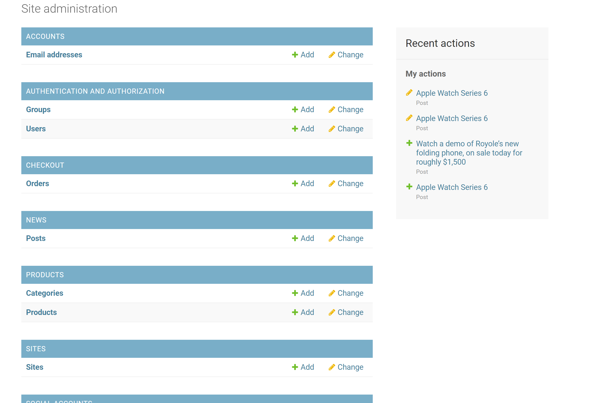
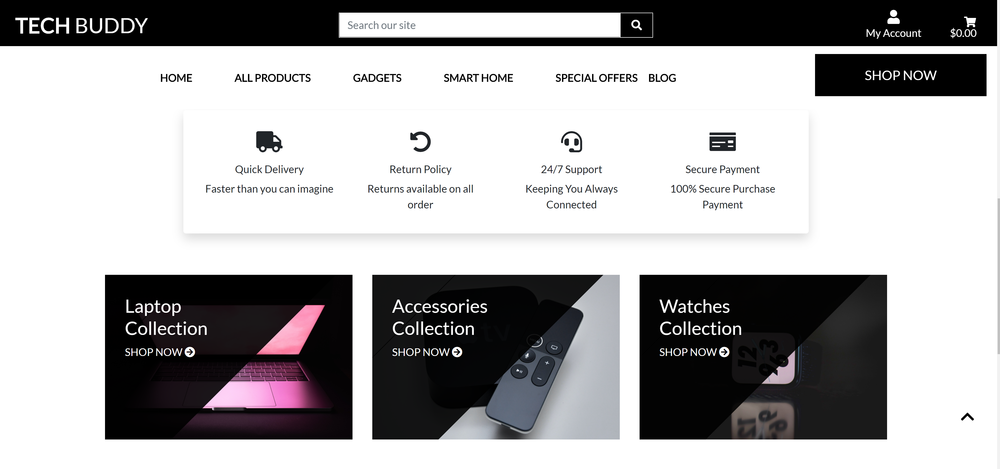
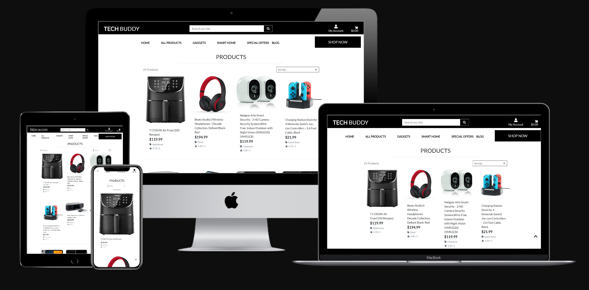
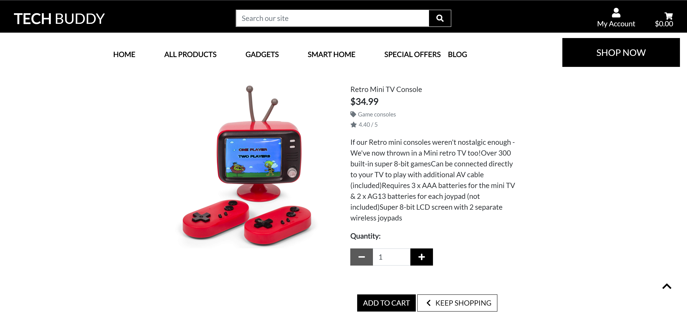
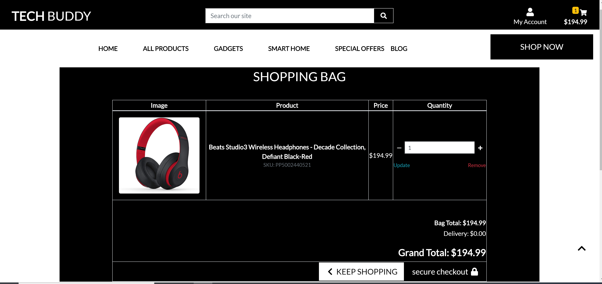
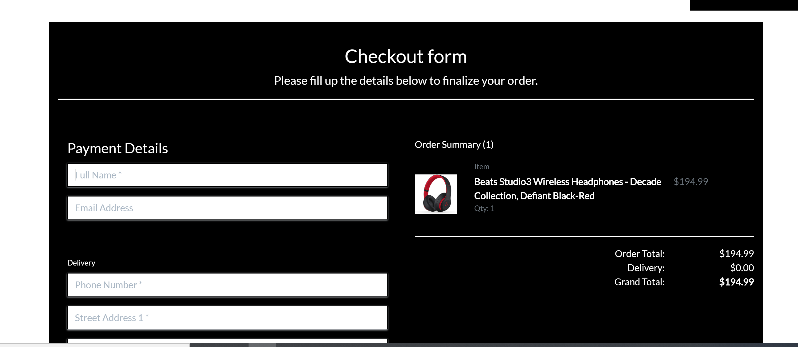
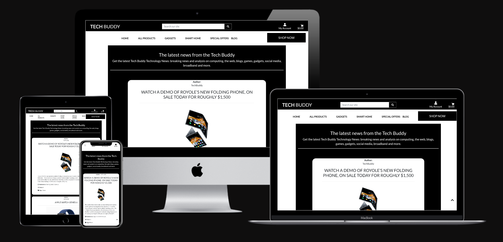

<h1 align="center">
<br>
  
  <br>
    <br>
   TECH BUDDY 
  <br>
</h1>

<h3 align="center">Full Stack Frameworks with Django Milestone Project </h3>

<h4 align="center">Ecommerce & Blog Web Application with Stripe Payments</h4>

- [Live link](https://tech-buddy.herokuapp.com/)
- [Github Link](https://github.com/sree0831/MSP-4.git)
<hr><hr>

## Table of Contents

<!--ts-->

1. [About](#About)

    - [Goal](#Goal)
    -   [Strategy Plane](#strategy)
    -   [Project Charter](#charter)
    -   [Defensive Design](#def)

2. [UX](#UX)

    - [User stories](#User-stories)
    - [Layout Pro](#Layout-Pro-Boundless-Adaptability)
    - [Layout Con](#Layout-Con-Moderate-Speed-and-Execution)
    - [Navigation](#Navigation)
    - [Database Structure](#Database-Structure)
    -  [Wireframes](#wireframes)
        

3. [Technologies](#Technologies)

    - [Languages Frameworks Tools](#Languages-Frameworks-Tools)
    - [Installation](#Installation)
    - [Setting up Heroku](#Setting-up-Heroku)
    - [Features](#Features)
    - [Features Left To Implement](#Features-Left-To-Implement)
    


4. [Testing](#Testing)

    - [Tools-and-Methods-Used-for-Testing](#Tools-and-Methods-Used-for-Testing)
    - [Tested Sections 1 HTML & CSS](#Tested-Sections-1-HTML-&-CSS)
    - [Tested Sections 2 Python](#Tested-Sections-2-Python)
    

5. [Deployment](#Deployment)

    - [How the project got deployed to Heroku](#How-the-project-got-deployed-to-Heroku)
    - [How to access the live application](#How-to-access-the-live-application)

6. [Credits](#Credits)

    <!--te-->
## About

 **Tech Buddy** web application is related to Ecommerce based  site where  users can explore the products ,search ,buy products ,read about new gadgets in blog .

#### Goal

This project is my fourth milestone project for Code Institute, and it’s the Full Stack Frameworks with Django Milestone Project.
A Online E-commerce Store designed for the fictitious company named "Tech Buddy."
The aim of the project, according to the project guidelines, was to build a full-stack site based around business logic used to control a centrally-owned dataset.
This project will demonstrate what I have learned in the course from frontend, backend and full stack web development with stripe payments.
# Strategy Plane
The overall aim of the project is to create a functional app logic created with **Python** while utilising the **Django**framework,**AWS S3 Bucket**,Relational database and stripe payements. The logic of the app will be written using a variety of technologies but predominantly using the Python Django framework, jQuery and MySQL.  HTML, CSS, and JavaScript will be used to enhance the look and feel of the application. 
## Project Charter 
||Objectives |
|:---|:---|
|**Purpose:** What purpose does the website serve?|The purpose of this project is to create a ecommerce website  called Tech Buddy that sells innovative products |
|**Goals:** What outcomes does it need to achieve?|<ul><li>allow users to search products and read description about products  </li><li>add them to basket  </li><li>update your basket</li><li>shopping cart checkout based on stripe payments</li></ul>
|**Target audience:** Whom must the product appeal to and work for?|<ul><li>Users just browsing for gadgets </li><li>Checking for latest gadgtes news</li></ul>|
|**Success indicators:** How will you know you have achieved project goals?|A steady increase in the number of orders added by users to superuser admin  would be a clear indication of the success of the application|
|**Strategies:** What approaches will help to realise the goals?|<ul><li>We will take a mobile first approach to Content</li><li>Provide useful, interesting and focused content for our target audience</li><li>Aim to keep the site simple and not over complicated</li><li>Present content in a clear and user-friendly way</li></ul>
|**Tactics:** What activities might help to realise the strategies?|<ul><li>Provide useful and relevant content to users</li><li>Provide a user experience that is accessible and enjoyable for all visitors</li><ul><li>following conventions for design and interaction</li><li>providing clear and consistent navigation</li></ul></ul>

## Defensive Design
Defensive design for Tech Buddy application will focus on the most common points of failure: user input areas, feedback and server problems.
*	I will employ form validation to check for user .
*	I will protect users from server errors and broken links with informative messages .
*	My Defensive design will assist the user before mistakes happen with rechecking password during signup.

The user will be informed if that username has already been taken and asked to enter a different username. The form will have validation and offer clear instructions to users on how to proceed.
Environmental variables have been used to protect access details to the database.

<hr><hr>

## UX
This platform hass been built to be fully responsive so it works perfectly on any device and screen size.

### User stories
Below are some of the potential stories that users can follow:
The purchasing system is easy to use and allows for quick checkout. A drop down with a list of countries has been included in order to facilitate typing. 

Three main users were created:

1.	Superuser (admin) can add latest news in blog ,add products, description of product, price and image.
2.	General browsing users who are potential customers who have browsed on to the website but did not register
3.	Authenticated users who are customer of the site by registering (adding their contact details and creating a user and password)


- A new user should be able to:
    - Visualize a homepage with all products and blog entries.
    - Visualize the main navigation (sticky) with links to the main sections.
    - Visualize a search bar for finding products.
    - User always have the option to go to any page thanks to a sticky navbar with all pages accesible from there.

- If I user want to purchase a product they should be able to:
    - Visualize all products in one page
    - User can select products from stickynavbar depends on their criteria.
    - Register a new account or login to existing one.
    - See the account profile.
    - Registered User can update their profile and view order summary in their profiles.
    - Search individual products from anywhere through the searchbar on the navbar.
    - Add to cart.
    - Visualise a list of the final order and change that order (remove or edit)
    - Add contact details and payment option
    - Pay

#### Layout Pro 

- Choosing a **multiple page application (MPA)** takes into consideration the choice to make new content and spot it on new pages. Multi-page applications can incorporate as much data as required.

#### Layout Con 

- Being as this is a multi-page application, a server needs to reload most assets, for example, HTML, CSS, and **Python** with each interaction. When loading another page, the browser completely reloads page information and downloads all assets once more, even rehashed segments throughout all pages (for example the header/navigation) which influences Speed and Execution.

#### Navigation

- A navigation bar takes up space and was fixed to top  . 
The navbar will be available to users at the top of the application on every page.
Unregistered users will see links to Register,Login.
Registered users will see links to LogOut, Profile in my account.
- Users can select products depending on their categories with shop now option which leads to all products page .


### Database structure
- Django normally works with SQL databases and comes prepacked with sqlite3. 
- During development on my local machine I worked with the standard sqlite3 database installed with Django. On deployment, the SQL database provided by Heroku is a PostgreSQL database.

##  Wireframes

## Home Page (‘/’ index.html)<a id="homewf"></a>


## Product Page (‘/products  products.html)<a id="productswf"></a>


## Technologies
# Languages, Libraries & Frameworks

* This project uses **HTML**, **CSS**, **JavaScript** and **Python** programming languages.

## Tools used

* **Balsamiq** to create the wireframes for this project.
* **Visual Studio Code by Microsoft** - This was used as the IDE for building the application. This was my second time using a local IDE for a Milestone Project. 
* **Django** as python web framework rapid development and clean, pragmatic design.
* **Git** to handle version control.
* **GitHub** to store the project code remotely.
* **PIP** for installation of tools needed in this project.
* **Stripe** as payment platform to validate and accept credit card payments securely.
* **Heroku** for deployment
* **Travis** for continuous integration.
* **AWS S3 Bucket** to store static files in the cloud.
* **Django Crispy Forms** to style django forms.

## Libraries utilised

* **Google Fonts** to style the website fonts.
* **FontAwesome** to provide icons for the online store.
* **Bootstrap 4** to simplify the structure of the website and make the website responsive easily.
* **jQuery**

## Databases

## Databases used

Django normally works with SQL databases and comes prepacked with sqlite3. During development on my local machine I worked with the standard sqlite3 database installed with Django. On deployment, the SQL database provided by Heroku is a PostgreSQL database.

# Installation

 - I used [Code Institute](https://codeinstitute.net/) lessons to make this project.

 #### User Authentication
    - login/logout/registration and password request features via completion of relevant forms.
      - specific logged in user access 
        - create/update/delivery address
         - see profile page
            - see orders placed

Follow the below instructions to download this project for Windows (This instructions could be different for Mac) and I used gitpod to do my project.

1. Start with [gitpod-full-template](https://github.com/Code-Institute-Org/gitpod-full-template) provides extensions and tools for  for Code Institute students.
Open the gitpod tempate and install Django:
`pip3 install django==1.11.24`

2. Create a project on your console 
`django-admin startproject ecommerce .` (Dot on the end means that won't be put down another level in our directories)

4. Create your on env.py and  .gitignore
Here (env.py) you can put all your secret Keys, and put it on .gitignore **MAKE SURE IT IS IN THE .gitignore FILE**

5. Hide/create secret keys and generate secret keys / stripe secret key
Make sure you create this secret keys, if you download the project they will not be there
* A new SECRET_KEY can be generated [here](https://www.miniwebtool.com/django-secret-key-generator/)
* Set up an account with Stripe [here](https://stripe.com/gb) & input STRIPE_PUBLISHABLE_KEY & STRIPE_SECRET_KEY
If working locally you will need to update the settings.py and comment back in env.py.

6. Go to setting.py  and this is what you should change

```
AWS_STORAGE_BUCKET_NAME =
AWS_S3_REGION_NAME = 'eu-north-1'
AWS_ACCESS_KEY_ID = 
AWS_SECRET_ACCESS_KEY = 
AWS_S3_CUSTOM_DOMAIN = 
STATICFILES_LOCATION = 'static'
STATICFILES_STORAGE = 'custom_storages.StaticStorage'
STATIC_URL = 
MEDIAFILES_LOCATION = 'media'
DEFAULT_FILE_STORAGE = 'custom_storages.MediaStorage'
MEDIA_URL = 

```
8. In the terminal:
    `$ python manage.py migrate` - this will apply migrations to your local sqlite database
    `$ python manage.py createsuperuser` - this will create admin support so you can change or add product
    `$ python manage.py runserver` this is how you run your local project

9. To run the project on localhost, run the following in the Gitpod terminal:
```python3 manage.py runserver```


10. Log in to the admin panel by going to '127.0.0.1:8000/admin' and log in using the credentials you created for the superuser.
You will see something like this:




11. Django-countries 

 #### Installation CountryField

 1. ```pip install django-countries```
 2. Add ```django_countries to INSTALLED_APPS```

 #### CountryField

Consider the following model using a CountryField:

```
from django.db import models
from django_countries.fields import CountryField

class Person(models.Model):
    name = models.CharField(max_length=100)
    country = CountryField()
```  

# Setting up Heroku


Heroku=
I went to [Heroku](https://www.heroku.com/) to set up an app 'Tech Buddy'

Resources> add database **Postgres** choose **'HobbyDev Free'**

For use of Heroku Postgres =
- On Gitpod console install dj-database-url: ` pip3 install dj-database-url`. This package allows connection to a database URL.
- Then install psycopg2  `pip3 install psycopg2` which allows connection to the postgres database.
- Create a requirements.txt file  ```pip3 freeze > requirements.txt```
**import dj_database_url** at top of settings.py file and change default sqlite3 database to be default dj_database_url
```DATABASES = { 'default' :dj_database_url.parse(os.environ.get('DATABASE_URL')) }```
Add DATABASE_URL config vars code to env.py 
Make migrations to migrate all files to new database.

```
python3 manage.py makemigrations
python3 manage.py migrate

```
Create new superuser via ```python3 manage.py createsuperuser``` and add username, email and password.
This will be production database for deploying on Heroku

Ensure Heroku has all Config Vars required = SECRET_KEY, STRIPE_SECRET, STRIPE_PUBLISHABLE, AWS_ACCESS_KEY_ID, AWS_SECRET_ACCESS_KEY
add DISABLE_COLLECTSTATIC and set to 1 this will disable staticfiles from being added to Heroku meaning can use AWS bucket.
To allow deployment via github automatic/manual select Deploy> GitHub> connect to repo = 'ecommerce' in Heroku menu. For automatic deployment select button 'enable automatic deploys'.
Otherwise use manual deployment to 'deploy branch'.

Gitpod=

- Deploy>GitHub
- Install gunicorn ` pip3 install gunicorn`.
- Ensure all dependencies are added to requirements.txt with command ```pip3 freeze > requirements.txt```
- Create and add a file called **Procfile** which contains text 'web: gunicorn ecommerce.wsgi:application'
```git add, git commit, git push```
- Heroku >deploy branch
- Heroku >more >restart all dynos to ensure that the project is updated.

Make sure you put the your Heroku git URL here ``` ALLOWED_HOSTS = [] ```

And then you can run your apllicaction on Heroku.

####  Features

1. Home Page

<br>
  
  <br>

  - It starts with products carousel followed by delivery ad ,links to collections and ends with a footer.
<hr><hr>

 2. All Products
<br>
  
  <br>

  - can browse all products ,sort them by price ,rating ,name 
<hr><hr>

3. Product Detail
<br>
  
  <br>
  - Users can read product description ,update quantity of products,option to add to the cart button.

<hr><hr>

4. Bag

<br>
  
  <br>

  - users can view their products in cart with prices ,delivery charges and grand total.
<hr><hr>

6. Check out page

 <br>
  
  <br>

  - Asks users for payment deatils with shipping address

  - Users can see their order summary and option to use card payment .
<hr><hr>

7. Blog

<br>
  
  <br>
 
  - users can read about new gadget news from the blog with published date ,views .
<hr><hr>

8. Profile Page

 <br>
  
  <br>

  - Only signup users can view this page witha profile image and login details. 
  - users can also update their delivery information and view their order summary.
<hr><hr>

#### The Footer

The Footer is on every page. The footer has been kept clean and simple. Links to Products, Social Media links and The company name and caption. Also included at the bottom of the logo is Copyright 2020 & name of the developer.


#### The Register Page

When a user is not logged in, the register nav item appears in the Nav bar. A user will be able to register, via the register form on the register page. If a user with an account, finds themselves on this page by mistake, they are guided to click "HERE" to direct them to the login page. Within the register form, are fields for email address, Username, Password and Password Confirmation.

#### The Login Page

The login page features a standard login form asking for username and password. 

#### The 'My Profile' Page

This option on appears in the nav bar when the user has logged in. once clicked, the user is directed to another page, where the page displays their email address and username.

#### Features Left To Implement

- Product Review Page, where previous customers and existing and previous users of the web store can give feedback on items purchased.

- A wishlist, where the user can pick products and "favorite" them, before deciding to add them to the cart or not. The user can click on the wishlist link and review the products they have favored. This saves time and gives the user a better user experience overall.

## Testing

#### Tools and Methods Used for Testing

- HTML

  - [Freeformatter](https://www.freeformatter.com/)

  - [The W3C Markup Validation Service](https://validator.w3.org/)

- CSS

  - [The W3C Markup Validation Service](https://jigsaw.w3.org/css-validator)

- Python

  - [Python Formatter](http://pep8online.com/)

- Phones

  - Galaxy Note 3 (simulation and actual device)
  - Galaxy Note 9
  - Galaxy S5
  - Galaxy S9/S9+
  - iPhone 5/SE
  - iPhone 6/7/8 (simulated and real device)
  - iPhone 6/7/8 Plus
  - iPhone X
  - LG Optimus L70
  - Microsoft Lumia 550
  - Microsoft Lumia 950
  - Nexus 5X
  - Nexus 6P
  - Nokia 8110 4G
  - Pixel 2
  - Pixel 2 XL

- Tablets
  - iPad (simulation and actual device)
  - iPad Mini
  - iPad Pro (10.5-inch)
  - iPad Pro (12.9-inch) (simulated and real device)
  - Kindle Fire HDX
  - Nexus 10
  - Nexus 7

- Website responsiveness was also tested by resizing .


#### Tested Sections 1 HTML & CSS


- Checked button sizes so, they were responsive and large enough to be clicked.

- Ensured individual section headers resized and appeared well when viewed on various device screens and added opacity to the navigation bar to allow for more visibility of section header area on smaller devices.

- Spell checked all text content.

- HTML and CSS validation via [w3.org](https://www.w3.org/ "W3C Official Site").

- Checked margins and padding of the container (sections) to ensure the content within it did not look disproportionate on various screen sizes, individually smaller devices.

#### Tested Sections 2 Python

Manual testing was embraced for this application and acceptably passed. An example of the tests directed are as per the following:

- Tested route catches and hyperlinks all through the page.
- Tested the rationale of the application by looking at expected conduct against the database record information.
- Tested the responsiveness of the application on various programs and after that utilising multiple gadgets.

## Deployment

#### How the project got deployed to Heroku
### Introduction
* This website was deployed using Heroku.
* The code for the site was written using Gitpod.

### Creating the app on Heroku
* To deploy it on Heroku, I first signed into Heroku, using the username and password, which I’d chosen when I first registered with Heroku.
* Once signed into Heroku, I went to the Heroku dashboard.
* I clicked on ‘New.’
* I then clicked in ‘Create new app.’ 
* This took me to a page where I named the app. The app had to be unique, and I chose the name ‘Tech Buddy.’
* I was also able to choose a region – for this, I chose Europe.
* I then clicked on ‘Create app,’ which took me to the app’s dashboard, as it was now created.
* On the dashboard, I clicked on ‘Resources’.
* In the ‘Add-ons’ section, I searched for Heroku Postgres and selected it. 
* I then chose the Hobby Dev – Free option.
* This added a Database URL to the app’s config vars.

### Creating a new database
* On my Gitpod workspace, I installed dj_database_url, psycopg2, and gunicorn.
* In settings.py I updated the databases section with the new Heroku Postgres database information, and added the Database URL to env.py.
* I then did makemigrations and migrate, to add information to the new database.
* I then created a new superuser.

### Deploying the website
* On Heroku, I updated the config vars section with information that was saved in my env.py file.
* Before I pushed the code from Gitpod to the Heroku server, I created two files – requirements.txt (which contained a list of the dependencies my site was using) and a Procfile (which contained the instruction ‘web: gunicorn coffeeshop.wsgi:application’).
* On Heroku, I clicked on the Deploy tab, and then clicked GitHub.
* I searched for the name of my repository and then connected to it.
* I also enabled ‘automatic deploys’ so that the website would automatically update.
* Once that was done, I was then able to push the code to Heroku using the commands ‘git add,’ ‘git commit,’ and then ‘git push.’

#### How to access the live application

- A live demonstration is accessible by clicking [here](https://tech-buddy.herokuapp.com/ "Live Demonstration: Tech Buddy").

## Credits
- Code Institute lessons are the backbone of this project for creating products page and checkout page .
- All products  including their images, with prices were taken from the Amazon website.
- Slack and lots of tutorials from web .
- CSS and JavaScript libraries.
- For my Mentor who guided me in building this website.
- I also had help from [W3Schools](https://www.w3schools.com/) and [Stack Overflow](https://stackoverflow.com/) when trying to solve problems with my code.
- I also used Code Institute [Slack](https://slack.com/) to look for help when I needed it.
#### Inspiration
- From my 8 year old Daughter who always encourages me with her ideas and suggestions in building this project !